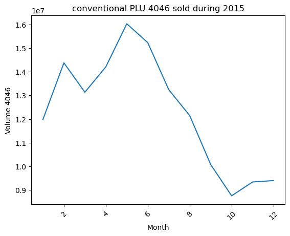
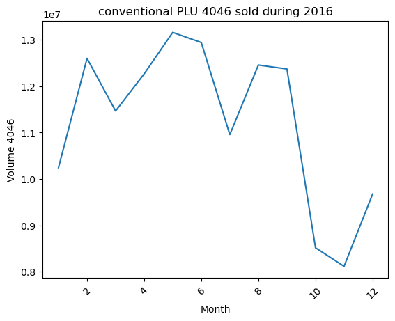
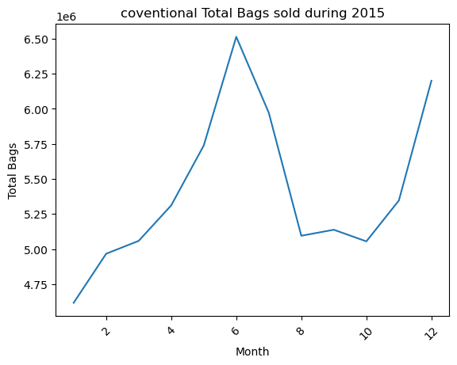
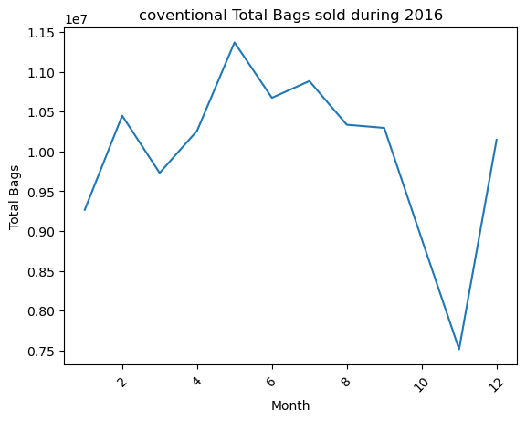
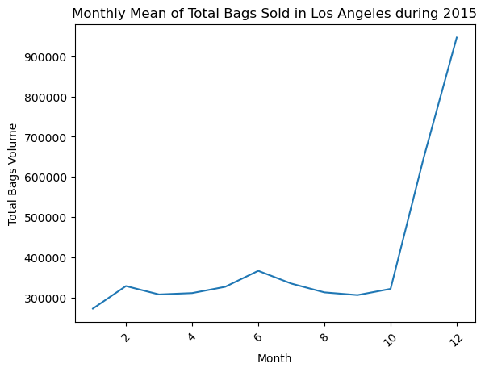
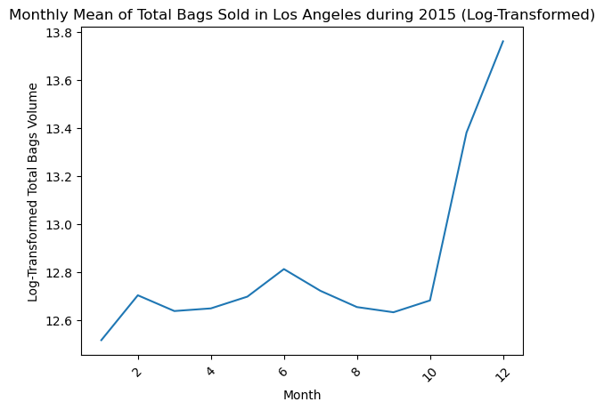
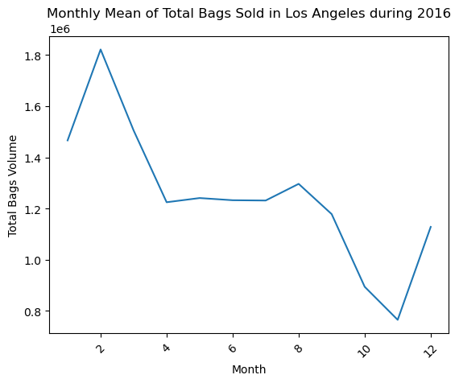
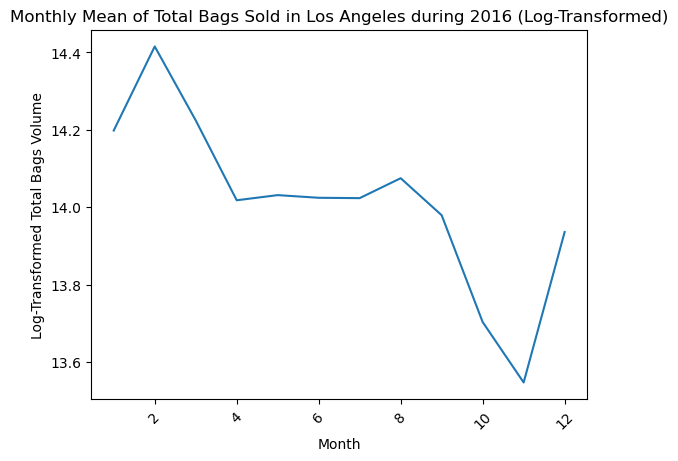

# ניתוח נתונים - פרויקט גמר

## תיאור הנתונים סטטיסטית ומילולית
סט הנתונים שלנו מייצג מדידות שבועיות עבור מחירים ונפחים של אבוקדו שנמכר בארה״ב בין השנים 2015-2018. הנתונים שנמדדו כוללים גם אזורים נרחבים כמו מזרח, מערב, כל ארה״ב, אך גם אזורים ספציפיים יותר כמו ערים. לכן יש אזורים שכביכול נמדדו מספר פעמים. על כן, בשאלות המחקר שלנו נבחר להתמקד בהשוואת ערים מול ערים אחרות (או מול עצמן) על מנת שלא יווצרו כפילויות.
Average price בטבלה משקף ממוצע עלות לאבוקדו בודד, וקודי בדיקת המוצר (PLU's) בטבלה מיועדים רק לאבוקדו Hass (קליפה שחורה). זנים אחרים של אבוקדו (קליפה ירוקה) אינם כלולים בטבלה זו.

### הערות נוספות לגבי הדאטה
העמודות 4046, 4225, 4770 מתייחסות לזנים של אבוקדו בגדלים שונים, ומרכיבות יחד את הנפח - total volume. כל עמודה מייצגת את הנפח של האבוקדו מסוג זה אשר נמכר.
העמודה type מציינת האם האבוקדו מסוג רגיל (conventional) או אורגני.

בעבודה שלנו, נתמקד ונחקור את העמודות הבאות בשנים 2015 ו2016:
- 4046 - סך כל הנפח של אבוקדו מזן 4046 אשר נמכר
- Total bags - סך כל הנפח של כמות האבוקדואים שנמכרו בשקיות

## נתונים סטטיסטיים עבור הדאטה
כפי שציינו קודם, יש כפילויות בדאטה כיוון שהיא כוללת אזורים רחבים אשר משתייכות אליהן ערים שמופיעות בדאטה גם בפני עצמן. לכן, בשלב התיאורי של הפרויקט נתמקד בממוצעים של כל ארה״ב - Total US (תחת העמודה region).
*בחרנו לעגל למספרים ללא ספרות אחרי הנקודה כיוון שמדובר במספרים מאוד גדולים (מיליונים לרוב).

- ממוצע נפח האבוקדו (total volume) הכולל לאורך כל השנים בכל ארה״ב (Total US): 17,351,302
- ממוצע נפח האבוקדו מזן 4046 שנמכר לאורך כל שנים בכל ארה״ב (Total US): 6,079,693
- ממוצע נפח האבוקדו מזן 4770 שנמכר לאורך כל שנים בכל ארה״ב (Total US): 462,057
- ממוצע נפח האבוקדו מזן 4225 שנמכר לאורך כל שנים בכל ארה״ב (Total US): 5,961,573
- ממוצע נפח האבוקדו שנמכר בשקיות (total bags) לאורך כל השנים בכל ארה״ב (Total US): 4,847,931
- ממוצע מחיר (average price) לאבוקדו לאורך כל השנים בכל ארה״ב (Total US) *כיוון שמדובר כאן במחיר ליחידה בודדת של אבוקדו, נבחר לעגל לשלוש ספרות אחרי הנקודה: 1.319

שאלות המחקר שלנו מתייחסות לשנים 2015 ו2016, ולכן נציג נתונים סטטיסטיים רלוונטים רק לשנים אלו.
*הערכים בגרף מאוד גדולים (0.9 = 9 מיליון). יכולנו לבצע עליהם טרנספורמציה (למשל לוג), אך כיוון שהנתונים מתייחסים לכלל ארה״ב ואנחנו בחרנו להתייחס לערים ספציפיות בשאלות המחקר שלנו, החלטנו לא לבצע שינוי בערכים. בנוסף, כל חודש מיוצג ע״י ממוצע דגימות של 4 שבועות.

ממוצע חודשי של זן 4046 (סוג רגיל) שנמכר בtotal U.S בשנת 2015:

ממוצע חודשי של זן 4046 (סוג רגיל) שנמכר בtotal U.S בשנת 2016:

בשני הגרפים ניתן לראות דפוסים דומים בנפח האבוקדואים שנרכשו בארה״ב בין החודשים ינואר עד יוני. לאחר מכן, מיוני לספטמבר ניכר שינוי משמעותי בין השניים. בהתאם למסקנות אלו, התעניינו בהפרש תוחלות בין השנים 2015 ו2016. בהמשך, באחת משאלות המחקר שלנו, נבחר ערים ספציפיות בארה״ב ומהן נדגום ונחקור הפרש תוחלות בין השנים 2015 ל2016.

בגרפים הבאים, 6= 6 מיליון. שוב לא בחרנו לבצע טרנספורמציית לוג לנתונים כיוון במחקר שלנו נתמקד בערים ספציפיות בארה״ב ולא בנתוני המדינה כולה.

ממוצע חודשי של נפח השקיות (סוג רגיל) שנמכרו בtotal U.S בשנת 2015:

ממוצע חודשי של נפח השקיות (סוג רגיל) שנמכר בtotal U.S בשנת 2016:

## מענה על שאלות המחקר

### שאלה ראשונה
האם ממוצע כמות השקיות שנמכרו בלוס אנג׳לס נשאר זהה בטווחי השנים 2015 ו2016 ברמת ביטחון של 90%?

- h0: הפרש התוחלות = 0
- h1: הפרש התוחלות ≠ 0
- רמת ביטחון = 0.9, α = 0.1
- Δ0 = 0

על מנת לענות על שאלה זו נשתמש במבחן t מזווג, מכיוון שאנחנו בוחנים את אותה האוכלוסייה תחת תנאים (זמנים) שונים. בנוסף, אנחנו תחת ההנחה שנבדקו אותן חנויות לאורך השנים (על מנת שזו תהיה אותה אוכלוסיה). כיוון שh1 שלנו הוא ≠ (אי שוויון) נשתמש במבחן דו צדדי. נבחר לדגום את 40 השבועות הראשונים שנמדדו בכל שנה, על מנת לשמור על אחידות (הסדר בדאטה הוא מדצמבר עד ינואר). בנוסף, נדגום רק אבוקדו מזן רגיל (conventional). n = 40

ראשית נציג את הגרף של הממוצע החודשי של נפח השקיות שנמכרו בלוס אנג׳לס ב2015:

כיוון שהגרף כולל ערכים מאוד גדולים בחרנו לבצע טרנספורמצית לוג על הנתונים. לאחר הלוג, הגרף של הממוצע החודשי של נפח השקיות שנמכרו בלוס אנג׳לס ב2015 יראה כך:

להלן גרף הממוצע החודשי של נפח השקיות אשר נמכר בלוס אנג׳לס ב2016, אשר ביצענו עליו לוג גם. *ביצענו טרנספורמצית לוג גם על ערכי שנת 2016 כדי לשמור על אחידות בהשוואת שני המדגמים.

כעת נענה על שאלת המחקר באמצעות הסטטיסטי:

בנינו טבלה עם העמודות הבאות: total bags 2015, total bags 2016, difference (בוצע לוג על כל הערכים כפי שציינו), וכך חישבנו את כל הפרמטרים הנחוצים לסטטיסטי. כל שורה מייצגת נפח שקיות כולל עבור שבוע אחד, כלומר סהכ יש בטבלה 40 שורות המייצגות את סך כל 40 הדגימות.

לאחר כל החישובים שבוצעו בקוד התקבל כי עלינו לדחות את h0, כלומר לא ניתן להניח כי ההפרש בנפח השקיות שנמכרו בלוס אנג׳לס בין השנים 2015 ו2016 הוא 0.

### שאלה שנייה
האם ממוצע נפח השקיות שנמכרו בשיקגו ב2015 שווה לממוצע נפח האבוקדו מזן 4046 שנמכר באותה שנה, ברמת ביטחון של 95%?

- X - נפח זן 4046
- Y - נפח השקיות
- D0 = X - Y
- h0: D0 = 0
- h1: D0 < 0
- רמת ביטחון = 0.95, α = 0.05

על מנת לענות על שאלה זו נבחן שני מדגמים ב״ת במבחן z, כאשר השונויות ידועות (נחשב אותן מתוך כל הדאטה שהיא האוכלוסיה). בנוסף, אנחנו שוב תחת ההנחה שנבדקו אותן חנויות בשתי המדידות. כיוון שh1 שלנו הוא >, נשתמש במבחן z חד צדדי שמאלי. נבחר לדגום את 40 השבועות הראשונים שנמדדו בכל שנה, על מנת לשמור על אחידות (הסדר בדאטה הוא מדצמבר עד ינואר). בנוסף, נדגום רק אבוקדו מזן רגיל (conventional). n1 = n2 = 40

כפי שציינו, הדאטה כוללת ערכים מאוד גדולים (במיליונים) ולכן נבצע שוב לוג על כל הנתונים טרם החישוב.

כעת נענה על שאלת המחקר באמצעות סטטיסטי המבחן. נחשב את x גג וy גג ע״י הפעלת ממוצע על 40 הדגימות הראשונות מ2015 בשיקגו. את השונויות נחשב על כל האוכלוסייה (כל הדגימות מ2015 בשיקגו).

לאחר החישוב יצא שעלינו לדחות את h0, כלומר לא ניתן להניח כי נפח השקיות שווה לנפח זן 4046 שנמכרו בשיקגו בשנת 2015.

## סיכום
סט הנתונים שלנו מייצג מדידות שבועיות עבור מחירים ונפחים של אבוקדו שנמכר בארה״ב בין השנים 2015-2018. בעבודה שלנו חקרנו את נפח האבוקדו מזן 4046 וכמות השקיות הכוללת אשר נמכרו בארה״ב. אנחנו התמקדנו בערים שיקגו ולוס אנג׳לס, בין השנים 2015-2016.

ראשית, טרם ניתוח הנתונים ביצענו טרנספורמצית לוג כיוון שהערכים בדאטה מאוד גדולים. לאחר מכן ביצענו את המחקר על בסיס המבחנים שלמדנו, ובשתי השאלות התקבל כי עלינו לדחות את h0.

**שאלה 1:** בהתבסס על ניתוח הנתונים שביצענו באמצעות מבחן t מזווג, התקבל כי לא ניתן להניח שהפרש התוחלות של כמות השקיות אשר נמכרו בלוס אנג׳לס בשנים 2016 ו2015 הוא 0, ברמת מובהקות של 90%.

סיבה אחת לדחיית השערת האפס יכולה להיות גודל המדגם: בחרנו מדגם בגודל 40, שעלול להיות קטן מדי ולא מספיק. אולי אם היינו בוחרות לדגום כמות גדולה יותר של שנים (במקום אחת) היינו מקבלות תוצאה אחרת; לדוגמה להשוות את כמות השקיות שנקנו בין השנים 2015 ו2016 בלוס אנג׳לס מול 2017 ו2018. כך המדגם שלנו יוכפל ואולי ייתן תוצאה יותר מדויקת.

בנוסף, לאור הגרפים שהתקבלו מהשנים 2015 ו2016 ראינו שבחודשים מסוימים יש התנהגויות דומות (למשל מחודש ינואר עד פברואר עלייה, וכנל לגבי חודש נובמבר עד דצמבר), אך בהיקפים שונים. לכן התעניינו בהשוואת התוחלות לאורך השנים.

**שאלה 2:** בהתבסס על המחקר שביצענו באמצעות מבחן z למדגמים ב״ת, התקבל כי לא ניתן להניח ש נפח השקיות שווה לנפח זן 4046 שנמכרו בשיקגו בשנת 2015.

כיוון שהמדגמים בלתי תלויים באמת הגיוני שהפרש התוחלות אכן יהיה שונה מ-0 כפי שהתקבל. כלומר דגמנו משתי ״אוכלוסיות״ שלא אמורות להיות קשורות זו לזו ולכן לא בטוח שעליהן להיות שוות. למשל יכול להיות שיותר אנשים מעדיפים לקנות אבוקדו בשקיות כיוון שבד״כ קנייה בכמות גדולה יותר משתלמת.

### שאלות נוספות שעלו לנו לגבי הדאטה
- האם במדינות גדולות יותר קונים כמות גדולה יותר של שקיות אבוקדו / אבוקדו מזן 4046?
- לאור התנהגויות דומות שזוהו בגרפים - האם בעונות מסוימות של השנה חלה עלייה בכמות הקנייה של אבוקדו? או להפך, האם חלה ירידה בעונות מסוימות?
- אם היינו דוגמים ממדינה אחרת באותן שנים, האם היינו מקבלים את אותן התוצאות כפי שהתקבלו במחקר שלנו?
